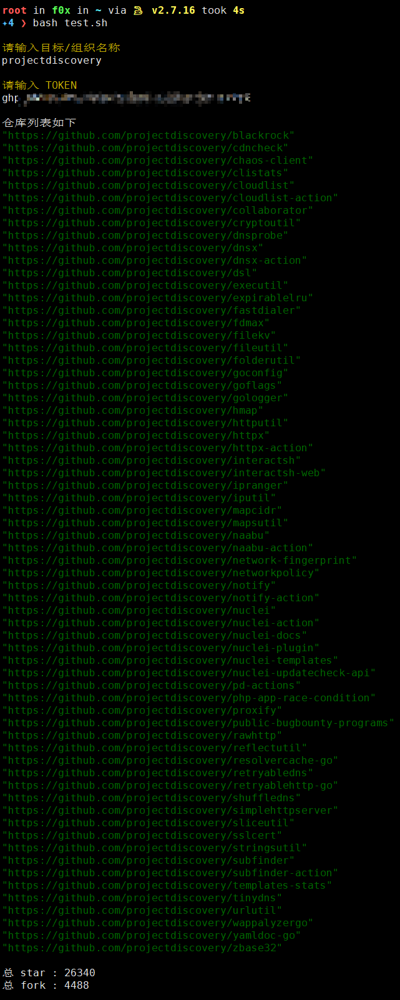

# repos_sum

计算组织下所有仓库star和fork数

---

> 默认只取100个仓库,超过请修改 page 参数

## 开始

**下载使用**

```bash
wget -O repos_sum.sh https://f8x.io/repos_sum
bash repos_sum.sh
```

**效果**



---

> create by ffffffff0x
